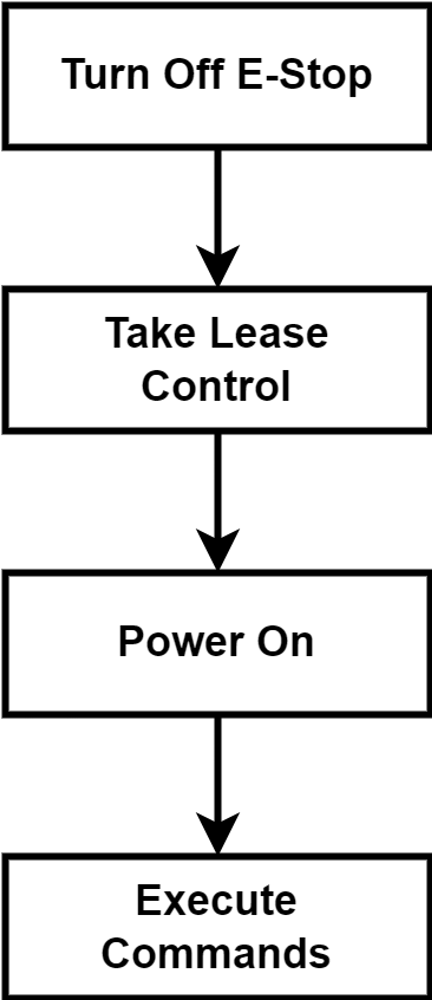
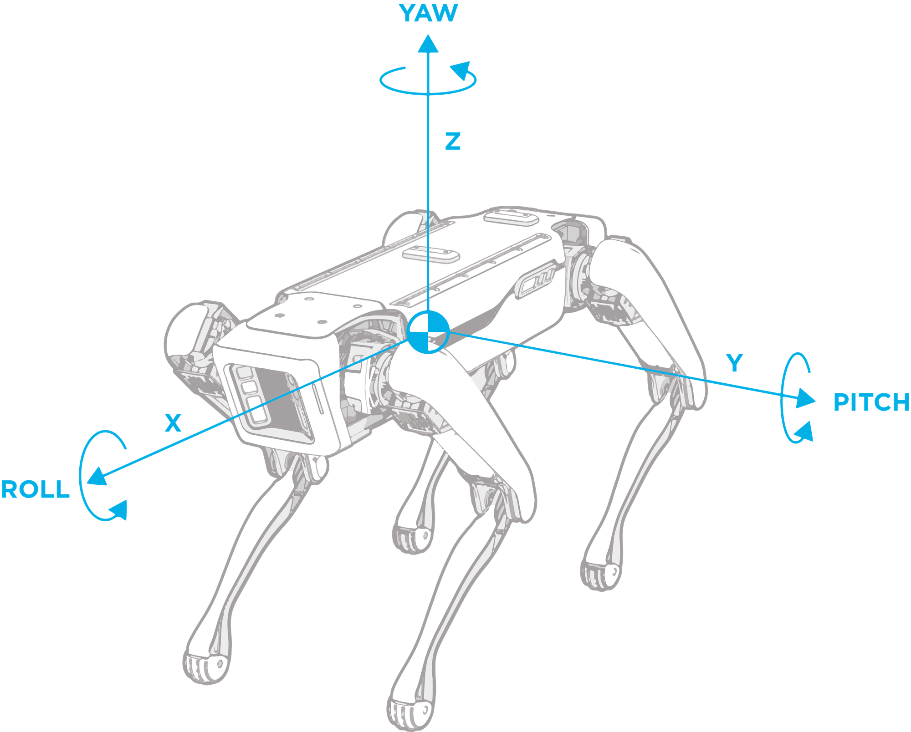

# Lesson #1 — Emergency Stop, Initialization, Body Position Control

## Intro

During this lesson, you will learn how to authorize yourself as a user, get motor power control and send basic commands to Spot.

## Theory

### Security
As and all serious robots, Boston Dynamics Spot has a protection mechanism — [E-Stop service](https://dev.bostondynamics.com/docs/concepts/estop_service) (Emergency Stop) that should always be active during the operation of the spot to avoid potential physical damage. Turning on E-Stop instantly freezes all joints (this happens without turning off the engines if the robot was turned on).

### Access
First of all, we should lease control over robot. There are two ways to do it — **acquire** or **take**. *Acquire* means asking for control in a gentle way, if anybody controls the robot now, your request will be declined. In another way, **take** means forcefully taking control, it doesn't matter if the current operator exists.

So, to make any movements, you should follow the scheme:




In this lesson you will learn how to control robot rotation by changing its yaw, roll and pitch. In the picture bellow the body frame coordinate system is shown:



> The angles in a code are represented in radians.

As a result of the lesson, you’ll draw a first letter of your name in the air with Spot’s face. Let start the setup!

## Connect to Robot

## Practice

Now we will make a simple script for Spot for drawing on screen using its head movements. Copy the following to program file:

```python
# Import Spot Control modules
import bosdyn.client
from bosdyn.client.robot_command import RobotCommandClient, blocking_stand
from bosdyn.client.robot_command import RobotCommandBuilder
from bosdyn.geometry import EulerZXY
import time

# ENTER YOUR AUTH DATA HERE (password will be giben to you by staff)
ROBOT_IP="192.168.80.3"
SPOT_USERNAME="admin"
SPOT_PASSWORD="2zqa8dgw7lor"


# Start with registering out SDK
sdk = bosdyn.client.create_standard_sdk('LessonOneClient')

# Create instance of robot and auth with credentials
robot = sdk.create_robot(ROBOT_IP)
robot.authenticate(SPOT_USERNAME, SPOT_PASSWORD)

# Create lease client and take exclusive control over Spot.  
lease_client = robot.ensure_client('lease')
lease = lease_client.take()
lease_keep_alive = bosdyn.client.lease.LeaseKeepAlive(lease_client)

# Try to power on the robot
robot.power_on(timeout_sec=20)
if robot.is_powered_on():
    print("Powered On")
		# If everything went smooth, Spot face lights should turn green
else:
		# In case of some problems, e.g. somebody stole control over robot
    print("Failed")
    exit(0)

# Synchronize Spor inner time with ours - to avoid outdated commands
robot.time_sync.wait_for_sync()

# To execute robot movement, create command client through which orders are sent
command_client = robot.ensure_client(RobotCommandClient.default_service_name)

# Start movement with simple stand up
blocking_stand(command_client, timeout_sec=10)

# Rotate robot body:
#  1. Build command for body rotation. It’s not an easy task to control robot motion with commands on low level. 
#     Bosdyn Client allow as to use a shortcut - RobotCommandBuilder. It contains a number of predefined commands, 
#     you need just to choose one of your liking and insert parameters
footprint_R_body = EulerZXY(yaw=0.1, roll=0.1, pitch=0.1)
cmd = RobotCommandBuilder.synchro_stand_command(footprint_R_body=footprint_R_body)
#  2. Execute builded command
command_client.robot_command(cmd)

time.sleep(2)

# Return robot to default stance
command_client.robot_command(RobotCommandBuilder.synchro_stand_command(footprint_R_body=EulerZXY(yaw=0, roll=0, pitch=0)))

time.sleep(2)

# Make robot change it's height
cmd = RobotCommandBuilder.synchro_stand_command(body_height=0.1)
command_client.robot_command(cmd)


# Now we are ready to draw letter. 
def draw_letter(command_client, points_yaw_pitch_roll):


    for yaw, pitch, roll in points_yaw_pitch_roll:
        footprint_R_body = EulerZXY(
            yaw=yaw,
            pitch=pitch,
            roll=roll, 
        )
        cmd = RobotCommandBuilder.synchro_stand_command(footprint_R_body=footprint_R_body)
        command_client.robot_command(cmd)
        time.sleep(1)


# Choose points to draw (yaw, pitch, roll) in radians. Check angle explaining image above in lesson to understand
points_yaw_pitch_roll = (
    (0.375, 0.375, 0),
    (0.125, -0.375, 0),
    (0, 0, 0),
    (0.25, 0, 0),
    (0, 0, 0),
    (0.125, 0.375, 0),
)
# In the example above, we tried to draw letter A. 
# For our purposes, roll is not that important. But you can try to experement if with!

draw_letter(command_client, points_yaw_pitch_roll)


# Turn off the robot gracefully
robot.power_off(cut_immediately=False)
```

> The limits of angles are recommended to be in limits of [-0.45, 0.45] for yaw, [-0.4, 0.4] for pitch and [-0.2, 0.2] for roll.

## Challange

Create a Python script that controls robot’s body position with a sequence of motions:

1. Stand-up
2. Trace your initials with it's face (one letter, at least 3 points)
3. Sit down

## Results

Now, you know how to:

- connect to the Spot
- work with Spot SDK
- construct a basic command
- rotate robot body

And even how to draw a letter. Congratulations!