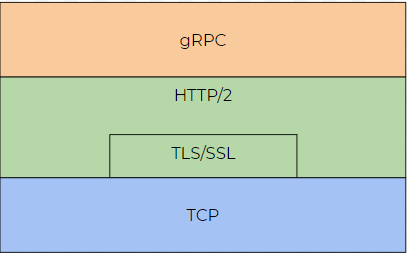

# Lesson #2 — Robot Services and State

## Intro

During this lesson, you will learn how Spot communicates with an operator, what are services, which of them are available, and practice working with Spot state.

## Theory

Let’s start with the way we communicate with a Spot under the hood.

### gRPC API

The Spot himself is a closed robot — no actions could allow you to directly control it, for example, with current in the motors. All control is based on the commands which ask Spot to do something. Commands are wrapped in gRPC requests and responses.

>[!NOTE]
> [gRPC](https://grpc.io/) is the application-level protocol used by the majority of the Spot API. gRPC was chosen because it provides a secure, performant protocol with support for a broad set of programming languages and environments.

If we want to get `RobotId`, meta information about Spot, we construct it like a proto-file, described with **Protocol Buffers**, a language-neutral mechanism for serializing structured data.

```protobuf
message RobotIdRequest {

	message RequestHeader {
		google.protobuf.Timestamp request_timestamp = 0;
		string client_name = 1;
		bool disable_rpc_logging = 2;
	}
	RequestHeader header = 0;
}
```

If we want to send a request with a message from above, we should use the appropriate service. For the `RodotID` it would be service with the same name:

```protobuf
service AuthService {
    rpc GetRobotId(RobotIdRequest) returns (RobotIdResponse) {}
}
```

As could be seen from the service definition, the method of service — `GetRobotId` — takes `RobotIdRequiest` as an input argument and return `RobotIdResponse`:

```protobuf
message RobotIdResponse {

	message RobotId {
		string serial_number = 0;
		string species = 1;
		string version = 2;
		RobotSoftwareRelease software_release = 3;
		string nickname = 4;
		string computer_serial_number = 5;
	}

	ResponseHeader header = 0;
	RobotId robot_id = 1;
	 
	...
}
```

[**Here**](https://dev.bostondynamics.com/protos/bosdyn/api/proto_reference#robot-id-proto) you could find a whole list of basic proto messages and services with a short description. It is useful to check them sometimes to deepen understanding of internal mechanics. 

The proto-files are compiled by some external compiler and transformed into classes of your programming language. Use [gRPC official documentation](https://grpc.io/docs/) to check available languages. It may be useful to check the quick start intro.

Spot gRPC API is the only way to communicate with the robot. To avoid extremely huge code for some trivial actions (e.g. move 1 m forward), Boston Dynamics developed their SDK for [Python](https://github.com/boston-dynamics/spot-sdk) and [C++](https://github.com/boston-dynamics/spot-cpp-sdk) (beta).  

*Python version of SDK will become our main target for all the lessons.*

gRPC is build on top of other networking protocols:
<p align="center">
    
</p>

Communication is performed with any of these IP-based network connections:

- Wire connection via Spot ports
- Spot’s Wi-Fi access point
- Wi-Fi client (when Spot is connected)
- Custom communication links (e.g. RadioKit) as payload

### **Services**

As was discussed in the previous part of the lesson, requests are sent to gRPC services. There are 5 [base](https://dev.bostondynamics.com/docs/concepts/base_services) and 7 [advanced](https://dev.bostondynamics.com/docs/concepts/robot_services) services that are required for the minimal work of the robot:
 
- `RobotId` — keep meta information about Spot
- `Auth` — authentication of user
- `Directory` — service is used to discover which services are currently running on Spot
- `TimeSync` — estimate the time offset between robot’s and application’s clock
- `Lease` — provides methods to take exclusive control over the Spot
- `Estop` — keep-alive mechanism of software Emergency Stop
- `Power` — switch on/off robot’s motors
- `RobotCommand` — robot’s movement
- `RobotState` — measurement and computational information collected at robot
- `Image` — interactions with all the Spot cameras (internal and supported external)
- `LocalGrid` — information about surrounding terrain, obstacles and their height
- `WorldObject` — track and store some special detected object’s information (name, location, etc.)

>[!NOTE]
> Take note that listed services do not include Mission, Navigation, Choreography and many other special. Some of them will appear in later lessons.

### E-Stop
As you already know, E-Stop is a service which is responsible for physical security. Active and not locked service required for robot movement and locked state make robot's motors to turn off. In principle, it works this way:
1. You construct your E-Stop endpoint config with name and timeout parameters
2. This endpoint is registered at robot. At this moment, time start ticking
3. Before timeout is reached, you should send check in with status, to reset the timer and state that you are still here.
4. If you reached timeout, E-Stop service will stop robot and unregister connection

>[!TIP]
> Fortunately, Spot SDK already has ready to use example of [GUI/Non-GUI script with E-Stop](https://github.com/boston-dynamics/spot-sdk/tree/master/python/examples/estop) 

E-Stop has 3 states:
- `None` - all motors are allowed to move
- `CUT` - all motors are frozen at the current state and forced to keep it. If the robot is powered off, this state does nothing
- `SETTLE_THEN_CUT` - gentle alternative to `CUT` when robot is powered on

### Robot State
The robot state service tracks all information about the measured and computed states of the robot at the current time. There are four types of request this service accept:
- `GetRobotState` — return various information about robot:
    1. power state
    2. battery state
    3. communication state
    4. system faults
    5. e-stop state
    6. kinematic state (position, velocities, coordinate frame information)
    7. behavior fault
    8. foot state
    9. service faults
    10. terrain state
    11. manipulator state (in case of attached arm)
- `GetRobotMetrics` — return accumulated metrics of the Spot like walked distance, uptime, gait cycles, etc.
- `GetRobotHardwareConfiguration` — allow as to expect skeleton of Spot and even get URDF model of robot.
- `GetRobotLinkModel` — instrument to get OBJ models of links that make up the robot.

### Time Synchronization

This service is critical for two reasons: 

- if you send a command, that already looks to be expired from the Spot’s side, it won’t be executed;
- If you send a command, which timestamp is ahead of Spot’s time, the robot will wait for the applied time to start.

Time synchronization is based on several measurements of request-response timestamps (`TimeSyncUpdateRequest`, `TimeSyncUpdateResponse`) . For application’s using Boston Dynamics Python SDK, it would be enough to use `TimeSyncThread`. For short-term scripts, it would be enough to synchronize time once, at the the start of control period.

## Connection
    Check first lesson paragraph. But this time with 
## Practice

1. Each of service's functions could be triggered from SDK with next scheme (authed `robot` could be copied from previous lesson):
```python
from bosdyn.client.robot_state import RobotStateClient
robot_state_client = robot.ensure_client(RobotStateClient.default_service_name)
```

Robot State coule be replaced with RobotId, Directory, and others service names.

2. One of the most enjoyable way to control Spot movement is a BosDyn example of WASD-control (move like in a video game)
```bash
cd spot-sdk/python/example/wasd
python3 wasd.py ROBOT_IP
```

3. Non-GUI E-Stop could be activated from SDK this way
```bash
cd spot-sdk/python/example/estop
python3 estop_nogui.py ROBOT_IP
```

## Challenge

1. Start with WASD script and walk around
2. Check, which services are started at the moment with DictionaryClient
3. In another script register RobotStateClient and get all the different info ([with different methods](https://dev.bostondynamics.com/python/bosdyn-client/src/bosdyn/client/robot_state)) about robot state
4. Download Robot ORDF model and visualize it

## Results
Now you know how:
- many services are there inside Spot
- to access basic services from SDK
- easy to move robot with WASD script

>[!TIP]
> It  to check insides of scripts from SpotSDK at Bosdyn Github

## References
- [Boston Dynamics Spot SDK Documentation](https://dev.bostondynamics.com/)
- [Clearpath Robotics Spot ROS Driver](https://www.clearpathrobotics.com/assets/guides/melodic/spot-ros/index.html)