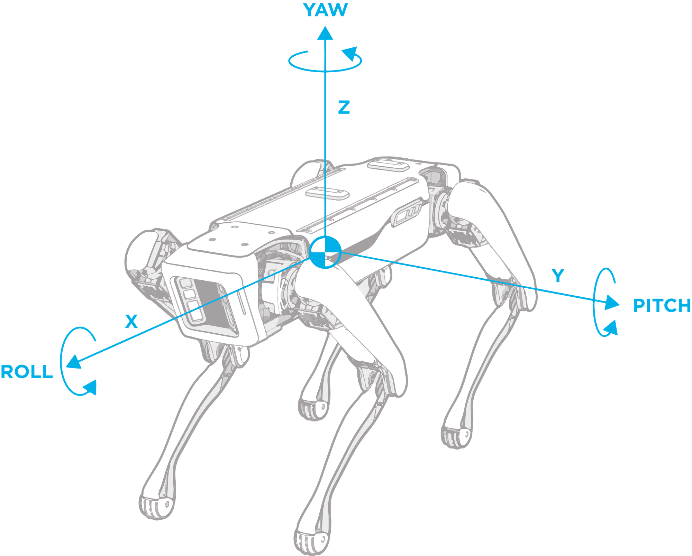
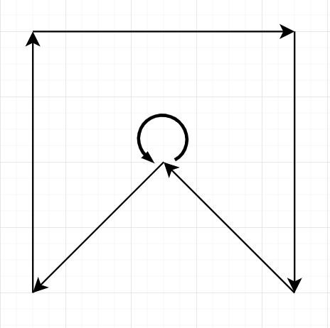

## Intro
During this lesson, you will learn how to move Spot in different ways.

## Theory

Before  

### Coordinate Frames

<p align="center">
    
</p>

Spot uses 3D transformations to describe itself, objects around it, and its understanding of the world. Spot has different frames to represent these objects. A 3D transformation is then used to describe a relationship between two frames using a translation vector and a rotation [quaternion](https://en.wikipedia.org/wiki/Quaternion). These transformations can be used to orient Spot in space and determine its location.

These transformations are expressed in 3D space using the `x`, `y`, and `z` axes. A translation is a 3 element vector `(x, y, z)` describing the difference between two frames’ origins. A rotation is a quaternion `(w, x, y, z)` that describes the change between two frames’ coordinate axes orientations. In the API geometry, we use an [SE3](https://en.wikipedia.org/wiki/Euclidean_group)Pose which encapsulate the rotation of Spot's body and translation of it's center used for transformation.

The following frames are known to Spot:

- `odom` frame: an inertial frame that estimates the fixed location in the world (relative to where the robot is booted up) using the kinematics of the robot.
- `vision` frame: an inertial frame that estimates the fixed location in the world (relative to where the robot is booted up), and is calculated using visual analysis of the world and the robot’s odometry.
- `body` frame: a frame describing the robot body’s position and orientation. The frame’s origin is at the geometric center of the hips with the x-axis pointing from the hip center to the middle of the front hips, as shown in the illustration above.
- `flat_body` frame: a gravity-aligned frame describing the robot body’s position and orientation. The position is at the robot’s center, and the x/y-axes lie flat in the `odom` frame x-y plane. Specifically, the x-axis is the normalized projection of the robot’s `body` frame x-axis to the `odom` x-y plane.
- `fiducial_XXX` frame: a frame that represents a raw fiducial detection, where XXX will be filled with the fiducial’s tag ID.
- `frontleft_fisheye` frame: an example sensor frame. This frame name represents the front-left fish-eye camera. All five cameras on spot have their own sensor frame names, which will describe the exact camera sensor’s position and orientation.

### Transformations

Spot has knowledge about many of the frames mentioned above and how they relate to each other. These relationships between frames can be stored in a graph-like structure, where an edge represents a transformation `A_tform_B`, and the nodes represent the frames `A` or `B`. The API creates a tree-graph of all the relevant frames, where each frame can uniquely be described relative to a different frame using transformations and all frames are described relative to a single root frame.

Different services provide a snapshot of the transformation tree graph at a given timestamp (which is described in the field acquisition_time), which includes transformations between `vision`, `odom`, and `body` frames in addition to any other relevant frames, such as the sensor frames for images or frames for world objects. All transformations in the snapshot are guaranteed to provide the most accurate SE3Pose for the timestamp.

Since frames are related to each other via transformations, we can change geometric data expressed in one frame to be expressed in another frame with the appropriate transformations. This is done by multiplying transformations together. For example

```python
vision_tform_body = vision_tform_odom * odom_tform_body
```

Also transformations could be inverted:

```python
vision_tform_body = vision_tform_odom * body_tform_odom.inverse()
```

To construct SE3 (and in some cases SE2) transforms, Boston Dynamics API has a [**math helper** tool](https://dev.bostondynamics.com/python/bosdyn-client/src/bosdyn/client/math_helpers).


### Robot Command and Command Builder

As you already know, to execute movement commands there are two important tools:

- [Robot Command Client](https://dev.bostondynamics.com/python/bosdyn-client/src/bosdyn/client/robot_command#bosdyn.client.robot_command.RobotCommandClient) — report all the commands to Spot in two possible ways:
    - sync — code execution stops until command is executed and target is achieved or some error accrued on the way. It launch with ****`robot_command` ****method.
    - async — code execution will continue and tracking success or failure of command is lays upon you. You can launch command with way by `robot_command_async` method.
        
        > Take note that sync/async terminology applied here shouldn’t be treated like that in Python. All the methods here are sync from the language side.
        > 
        
        Command execution result could be check via `robot_command_feedback` or `robot_command_feedback_async`.
        
        > One of the parameters that are used then you send command is `end_time_secs`. This time shouldn’t be too far away in a future. Boston Dynamics do not specify this time, but experiments shows that it is about 5 seconds from now. Other way you will receive `TooDistantError`.
        >

Robot Command Builder — the class which contains a set of static helper functions to build and issue robot commands. Most useful of them are listed below:

- `synchro_velocity_command` -- make robot to move along 2D plane with `v_x`, `v_y`, `v_rot` velocities in meter per second. Check detailed function description [Details](https://dev.bostondynamics.com/python/bosdyn-client/src/bosdyn/client/robot_command#bosdyn.client.robot_command.RobotCommandBuilder.synchro_velocity_command)
- `synchro_trajectory_command_in_body_frame` -- move robot with shift **relative to body**. [Details](https://dev.bostondynamics.com/python/bosdyn-client/src/bosdyn/client/robot_command#bosdyn.client.robot_command.RobotCommandBuilder.synchro_trajectory_command_in_body_frame)
- `synchro_se2_trajectory_point_command` -- same as the previous one, but work in estimated world coordinates (ODOM or VISION frame. [Details](https://dev.bostondynamics.com/python/bosdyn-client/src/bosdyn/client/robot_command#bosdyn.client.robot_command.RobotCommandBuilder.synchro_se2_trajectory_point_command)
- `battery_change_pose_command` -- command to set Spot in charging position (make sure there is free space around robot before usage). [Details](https://dev.bostondynamics.com/python/bosdyn-client/src/bosdyn/client/robot_command#bosdyn.client.robot_command.RobotCommandBuilder.battery_change_pose_command)
- `selfright_command` -- pair to previous command, allow Spot to stand up from charging position. [Details](https://dev.bostondynamics.com/python/bosdyn-client/src/bosdyn/client/robot_command#bosdyn.client.robot_command.RobotCommandBuilder.selfright_command)

## Practice

Default way to execute command looks like this

```python
...
from bosdyn.client.robot_command import RobotCommandClient, RobotCommandBuilder

command_client = robot.ensure_client(RobotCommandClient.default_service_name)

cmd = RobotCommandBuilder. # command funciton here

delta_t = 1 # time for command exection (especially important for velocity control)
command_client.robot_command(lease=None, command=cmd, end_time_secs=time.time() + delta_t)
```

1. Write a script that make robot stand, when set it to battery charge pose, stand with selfright_command
2. Using relative motion in point and velocity control compose a script for robot, to move like in the picture:



## Results
Now you know how:
- to work with robot coordinate frames
- move robot in different styles
- make charging pose